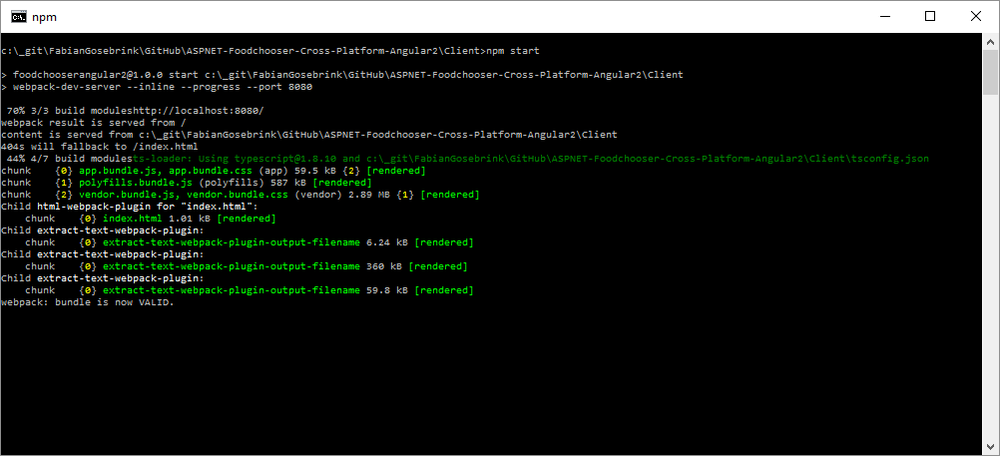
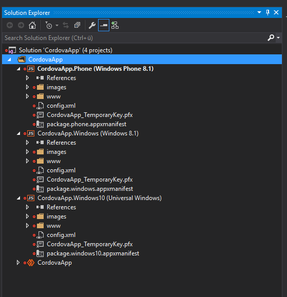
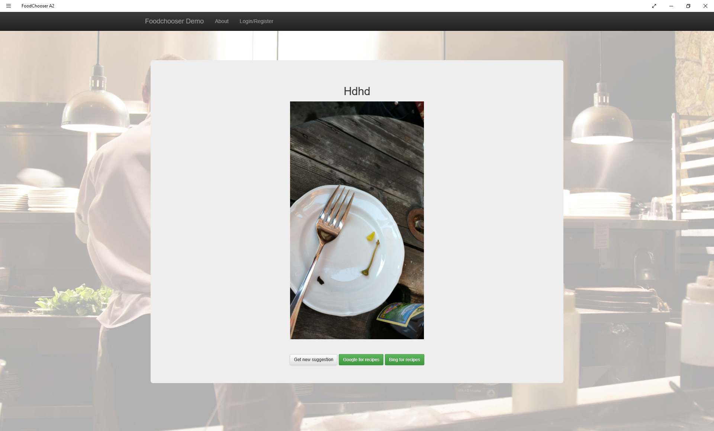
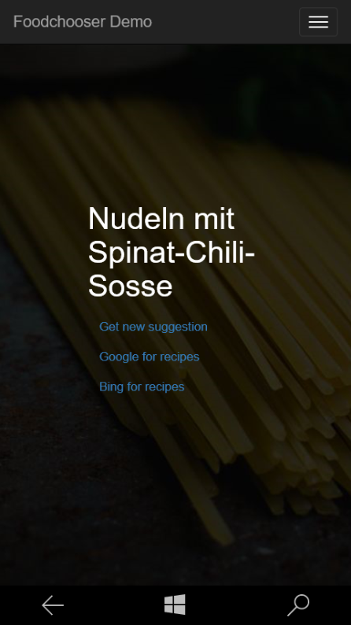
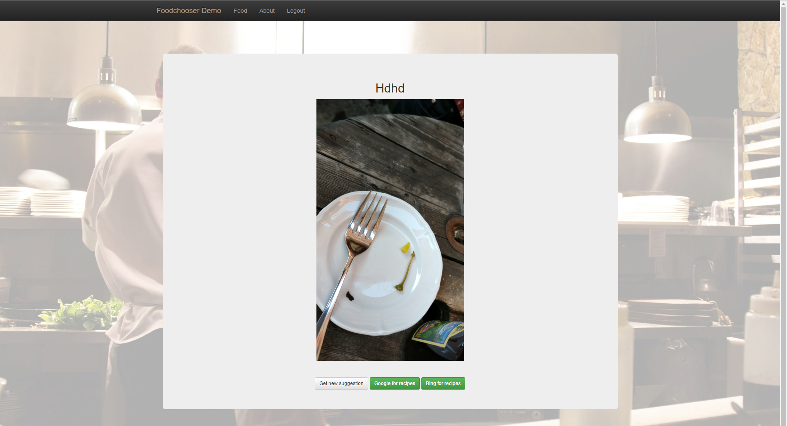

# ASP.NET // Webpack // Angular // Typescript // Ahead of Time (AoT) // TreeShaking // Cordova // Electron // Cross Platform - Project "Foodchooser" 

> Get the Android SDK here [Android SDK](https://developer.android.com/sdk/index.html/ "Android SDK")  
> Get the Windows SDK here [Windows SDK](https://developer.microsoft.com/en-us/windows/downloads/windows-10-sdk "Windows SDK")

> Make sure you have installed <br/>
> Typescript compiler: `tsc -v` = Version 1.8.10 <br/>
> Npm: `npm -v` = 2.15.1 <br/>
> Node `node -v` = v4.4.4 <br/>
> Cordova: `cordova -v` = 6.1.1  <br/>

## Blogposts
[Angular, ASP.NET WebAPI, Azure & Cordova, Cross Platform – My Private Hackathon Part 1](http://offering.solutions/blog/articles/2016/04/19/angular-asp-net-webapi-azure-cordova-cross-platform-2/)

[Angular, ASP.NET WebAPI, Azure & Cordova, Cross Platform – My Private Hackathon Part 2](http://offering.solutions/blog/articles/2016/04/26/angular-asp-net-webapi-azure-cordova-cross-platform-my-private-hackathon-part-2/)


### In this repository we have done an example app with 

* Angular
* Electron
* Cordova
* Typescript
* Bootstrap
* Automapper
* WebPack
* ASP.NET WebAPI 2.2
* Gulp.js
* NPM 
* Azure

### to make it cross platform, which means its working as an exe, as an app on phones and as a web application.

### This is done with

* Cordova (for the Apps)
* Electron (for the exe)
* Gulp (for the web application)
* WebPack (for the web application)
* ASP.NET WebAPI (for the backend)

### Feel free to add gulp tasks as you want :)

## This is the Angular 2 Version of the Foodchooser-Example. Find the Angular 1 Version here: [Angular1 Version](https://github.com/FabianGosebrink/ASPNET-Foodchooser-Cross-Platform-Angular1 "Foodchooser - ASP.NET WebAPI AngularJs Cross Platform")

# Start

Navigate to the "Client"-Folder and type in 
```
npm install
```
and
```
tsc
```
to install all dependencies and run 

```
npm start
```
and browse to "localhost:8080" to start the application.



If you want to start right ahead with the gulp tasks listed below just make sure you ran the <pre>tsc</pre> command in the client folder first.

# Cross Platform

## Cordova

In the client folder on level of the package.json type

```
npm run create:apps
```

## Electron

In the client folder on level of the package.json type

```
npm run create:desktop
```

## Web

In the client folder on level of the package.json type

```
npm run create:web
```

## Web & Apps & Desktop

In the client folder on level of the package.json type

```
npm run create:all
```

A `.dist`-Folder will be created containing all outputs.


#Screenshots

## Cordova-Project in Visual Studio


## Windows 8.1 App


## Windows 10 Mobile (old design)


## Android (with the new design)


## Windows 10


## Executable (Electron - with the new design)


## Web


